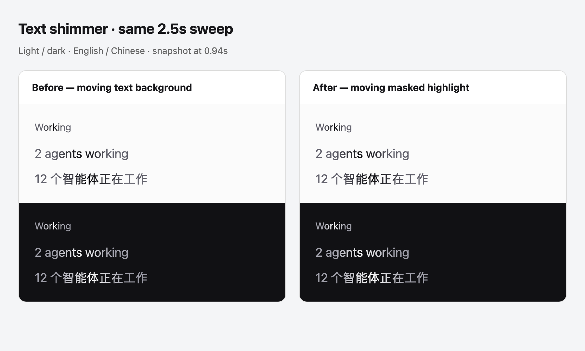

# ShimmerText

Use `ShimmerText` for a short, single-line activity label. It keeps the moving
highlight and 2.5-second cadence across light and dark themes. Apply it to the
label only; timers, avatars, and controls should remain outside.

```tsx
import { ShimmerText } from "@multica/ui/components/common/shimmer-text";

<ShimmerText active={isRunning} className="text-micro text-muted-foreground">
  {label}
</ShimmerText>
```

`children` is a string, including localized text. `active={false}` renders an
ordinary span and inherits the caller's text color. Active labels use
`--muted-foreground` with a `--foreground` highlight. Keep the typography's
normal line height so the clipped line box has room for descenders. Labels
truncate with an ellipsis when constrained by their container.

The base text remains accessible and selectable once. The decorative duplicate
is hidden from assistive technology and selection. Reduced motion removes the
highlight; forced colors also restores the system text color.

The highlight uses a static repeating mask translated over a counter-translated
text copy, replacing the previous animated `background-position`. It avoids
continuous text repainting in the tested Chromium versions, but still requires
style/compositing work and additional layers. Profile representative label
counts before assuming a whole-app CPU improvement.



Run the real-browser regression checks without an app server:

```sh
pnpm exec playwright test e2e/shimmer-text.spec.ts
```
